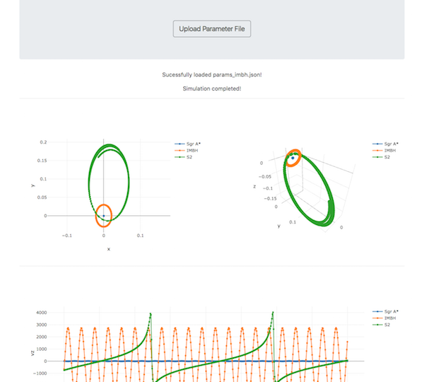

# Galactic Center Stellar Orbit Dashboard

This web service can integrate and visualize stellar orbits in the Galactic Center.

The orbit integration is performed using the [REBOUND](https://github.com/hannorein/rebound) code and its [REBOUNDx](https://github.com/dtamayo/reboundx) extensions, to account for first-order post-Newtonian corrections. The interface is built on top of [Dash](https://plot.ly/products/dash/).



Example parameter file:

```
{
  "R0": 8.3e3,
  "start_time": 1990,
  "end_time": 2030,
  "time_steps": 500,
  "enable_gr": true,
  "bodies": [
  {
    "hash": "Sgr A*",
    "m": 4.3e6,
    "x": 0,
    "y": 0,
    "z": 0,
    "vx": 0,
    "vy": 0,
    "vz": 0
  },
  {
    "hash": "IMBH",
    "m": 2.0e4,
    "a": 0.03,
    "e": 0,
    "inc": 0.78,
    "Omega": 0,
    "omega": 0,
    "T": 2000,
    "primary": "Sgr A*"
  },
  {
    "hash": "S2",
    "m": 0,
    "a": 0.126,
    "e": 0.884,
    "inc": 2.34,
    "Omega": 3.96,
    "omega": 1.15,
    "T": 2002.33,
    "primary": "com"
  }]
}
```

### Local Install

Please make sure you are running Python 3:
```
python --version
```
1) Download the code:
```
git clone https://github.com/pmplewa/GC-OrbitDash
cd GC-OrbitDash
```
2) Install any missing required packages (newer versions might work too):
```
pip install -r requirements.txt
```
3) Start the web server:
```
python server.py
```
4) Point your web browser to this URL:
```
http://localhost:5000/
```
